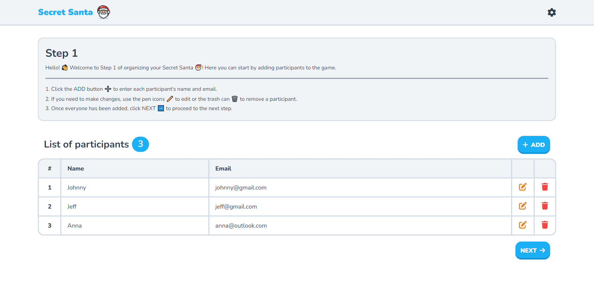
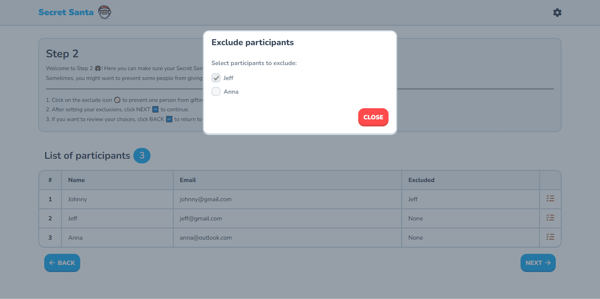
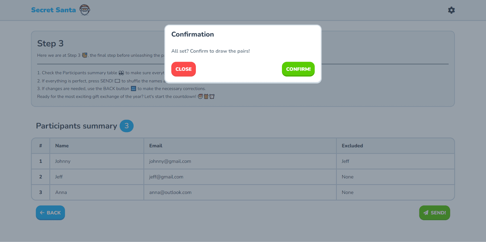

# Secret Santa 🎅

A very simple and easy to use web application for drawing names for the popular Secret Santa game!

# The App

This `Secret Santa app` is your new best friend for organizing and managing your Secret Santa events, making the whole process easier and more fun than ever before! Say goodbye to the stress of drawing names from a hat and hello to a smooth, automated experience that keeps everyone guessing and the holiday cheer flowing!

First off, we’ve got the super handy feature of `exclusion of pairs`. This app lets you exclude specific pairs of participants, ensuring that certain people do not draw each other. This nifty option keeps the surprise element intact and prevents any awkwardness!

Next up, the `personalized emails`. Once the names are drawn, each participant will receive their own secret email revealing the lucky person they need to buy a gift for. No more mix-ups or accidental revelations, it’s all hush-hush and between you and the app. This way, the excitement stays high and the secrecy is maintained to perfection!

And let's not forget the cherry on top, the beautiful `UI` and `UX`! With a gorgeous interface and user-friendly experience, you’ll find yourself enjoying every moment of organizing your Secret Santa event! The app is intuitive, visually appealing, and a joy to use, making the whole process not just simple but downright delightful!

On the `Front-end`, the app uses `Vue.js` for a dynamic and reactive interface. The styling is taken care of by `FlatifyCSS`, giving the app a clean and modern look. `Font Awesome` provides a wide array of icons that add both functionality and flair. And with `WOW.js`, I added some cool scroll animations to keep things lively and engaging!

On the `Back-end`, we’ve got `Node.js` powering the server-side operations, ensuring everything runs smoothly. `Express` serves as our web server, handling the routing and server logic. To top it off, `Nodemailer` takes care of sending out those all-important secret emails to each participant, making sure the right person gets the right information at the right time!

# Screenshots

Here are a few screenshots of the web app UI:

# Technologies

Here's a short list of some of the technologies utilized in this project:

## Front-end
- `Vue.js` (Framework)
- `FlatifyCSS` (Style)
- `Font Awesome` (Icons)
- `WOW.js` (Scroll animations)

## Back-end
- `Node.js` (Server-side code)
- `Express` (Web server)
- `Nodemailer` (Email)

## Hosting
- `GitHub` (Repository and CI/CD)
- `Aruba Cloud VPS` (Server hosting)